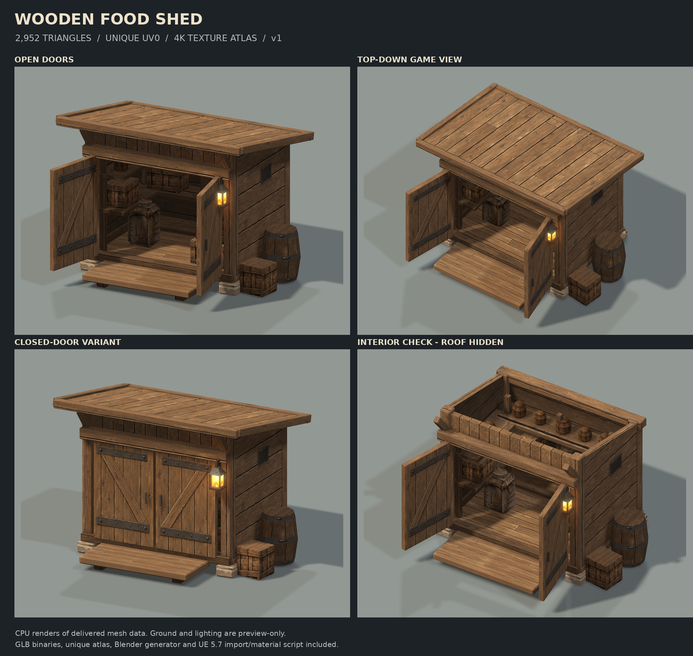

# 목재 식량 창고 — v1

[English](README.en.md) · [한국어](README.ko.md) · [日本語](README.ja.md)

첨부 레퍼런스를 바탕으로 제작한 탑다운 게임용 저폴리 목조건물입니다. 넓은 편경사 지붕, 굵은 목재 프레임, 열린 양문, 낮은 발판을 주요 실루엣으로 삼았습니다. 판재 틈·나뭇결·경첩·리벳·대각 보강대는 대부분 텍스처로 표현하고, 실제 메시에는 큰 형태와 얕은 모서리 다듬기를 남겼습니다.

**최종 열린 문 버전과 닫힌 문 버전은 각각 2,952 triangles입니다. 건물·문·내부 선반·포대·상자·나무통·도기·식량·등불을 모두 포함한 값입니다.** 두 파일은 대체 포즈이며 함께 배치할 필요가 없습니다.



## 핵심 사양

| 항목 | 값 |
|---|---|
| 포맷 | glTF 2.0 Binary / GLB |
| 최종 삼각형 | 2,952 / 버전별 |
| GLB 메시 / 머터리얼 | 1 / 1 |
| 내보낸 정점 | 6,064 — 면별 UV·노멀 분리 때문에 위치가 같은 정점도 포함 |
| Blender 재구성 시 메시 오브젝트 | 46개 |
| 고유 표면 UV 아일랜드 | 1,556개 |
| 텍스처 | 4,096 × 4,096 아틀라스 |
| UV0 밀도 | 약 222.09 px/m, 표면 실제 길이에 비례 |
| UV 여유 | 아일랜드 둘레 6px 확장 |
| 배치 영역 점유 | 사각 배치 영역 기준 약 72.5% |
| 외형 크기 | 열린 문 포함 약 폭 4.53 × 깊이 4.02 × 높이 3.28m |
| 원점 | 건물 중앙 기준 지면 높이 Z=0 |
| 제작 좌표 | Blender Z-up / 정면 -Y / 단위 m |
| GLB 좌표 | glTF Y-up / 단위 m |

정점 수와 삼각형 수는 서로 다른 값입니다. 4,000 제한은 삼각형 수로 검사했습니다. 미리보기의 지면·조명·그림자는 GLB에 포함되지 않습니다. 레퍼런스 주변의 잔디·흙 지형도 추가하지 않았습니다.

## 폴더 구성

```text
models/
  wooden_food_shed.glb              # 기본: 열린 양문, 2,952 triangles
  wooden_food_shed_closed.glb       # 대체: 닫힌 양문, 2,952 triangles
textures/
  T_Shed_BaseColor.png
  T_Shed_Normal_GL.png              # Blender / glTF용
  T_Shed_Normal_DX.png              # Unreal용; green 반전 완료
  T_Shed_ORM.png                    # R=AO, G=Roughness, B=Metallic
  T_Shed_Emissive.png               # 등불 영역만 발광
blender/
  create_wooden_food_shed.py
unreal/
  import_wooden_food_shed_ue57.py
source/
  mesh_payload.json                # 각 오브젝트의 정점·삼각형·UV 생성 데이터
  generated_architecture.png        # 이미지 생성으로 제작한 건축 표면 원화
  prop_*.png                       # AI 이미지에서 추출·보정한 소품 표면 원화
  texture_provenance.md
previews/
  hero.png / topdown.png / closed.png / rear.png / front.png
  interior.png                     # 내부 확인용: 지붕만 숨긴 실제 메시
  wireframe.png
  UV_Layout_4096.png
validation/
  asset_stats.json
  test_asset.py
  verification_report.json
  test_results.txt
  SHA256SUMS.txt
  ...
tools/
  build_asset.py                    # 원화 → 메시·UV·PBR 아틀라스·GLB 재빌드
  render_preview.py                # 실제 메시 CPU 미리보기 렌더러
```

## UV와 텍스처 제작 방식

UV0는 모두 0–1 영역 안에 있습니다. 서로 다른 면의 아일랜드를 겹치거나 미러링해서 공유하지 않았습니다. 타일링 셰이더, 반복 트림시트, 월드 좌표 패턴은 쓰지 않았습니다. 넓은 지붕·벽은 많은 픽셀을 받고 작은 철물·모서리는 적은 픽셀을 받도록 실제 표면 길이에 비례해 배치했습니다. 픽셀 반올림과 별개로 실제 UV 좌표는 같은 길이당 밀도를 유지합니다.

건축 표면 원화는 이미지 생성으로 제작했습니다. 소품 표면은 이미지 생성 결과의 해당 부분을 추출하고 원근을 보정했습니다. 이후 면마다 독립적으로 배치·리샘플링·합성했습니다. **공통 목재 원화의 부분 소스는 여러 면에 활용합니다. 최종 UV 공간이 고유하다는 뜻이며, 모든 작은 면을 각각 별도의 AI 원화로 생성했다는 뜻은 아닙니다.**

4K는 최종 아틀라스 해상도입니다. 모든 소스가 네이티브 4K인 것은 아니며, 큰 소품을 극단적으로 확대하면 원화의 해상도 한계가 드러날 수 있습니다. 탑다운 거리에서 큰 색과 재질 구분이 읽히도록 설계했습니다.

BaseColor는 색상 수를 정리한 뒤 호환성을 위해 채널당 8bit RGB PNG로 저장했습니다. Normal과 ORM은 작은 변화량을 정리해 불필요한 고주파 노이즈를 줄였습니다.

Normal과 ORM은 원화에서 추정한 보조 맵입니다. 고해상도 조각 메시에서 베이크한 노멀이나 측정 기반 PBR 맵은 아닙니다. ORM의 AO도 제한적인 이미지 기반 틈새 표현이며, 실제 접촉 그림자는 엔진 조명이 담당합니다. 등불은 별도 투명 유리 셰이더 대신 불투명 발광 면으로 단순화했습니다.

## GLB 바로 사용

`models/wooden_food_shed.glb` 안에는 메시, UV, 노멀, 탄젠트, BaseColor, OpenGL Normal, ORM, Emissive 이미지가 들어 있습니다. 같은 폴더에 외부 텍스처를 두지 않아도 GLB 하나로 읽을 수 있습니다. `KHR_materials_emissive_strength`를 사용하는 발광 강도는 2.3이며, 해당 확장을 무시하는 뷰어에서도 기본 발광 이미지는 남습니다.

GLB는 게임 배치용으로 합친 정적 메시입니다. 문을 움직이는 애니메이션이나 분리된 지붕 노드는 기본 GLB에 넣지 않았습니다. 문 열림을 조정하거나 지붕을 숨길 때는 아래 Blender 재구성 스크립트의 분리 오브젝트를 사용하세요.

## Blender에서 생성

대상은 Blender 4.2 이상 / 5.x입니다. ZIP을 **전체 폴더 구조 그대로** 풀고 새 Blender 파일에서 `blender/create_wooden_food_shed.py`를 실행합니다. Scripting 작업 공간에서 파일을 Open한 다음 Run Script를 누르거나, Python 파일 실행 메뉴를 이용할 수 있습니다. 이름 없는 텍스트 블록에 내용을 붙여 넣는 경우에는 스크립트 상단 `ASSET_ROOT`에 압축을 푼 최상위 폴더를 입력하세요.

이 스크립트는 GLB를 다시 임포트하지 않습니다. `source/mesh_payload.json`의 명시적인 정점·삼각형·UV 데이터를 이용해 `bpy.data.meshes`로 재구성합니다. Blender 안에서 별도의 외부 Python 라이브러리를 설치할 필요가 없습니다.

`WoodenFoodShed_v1` 컬렉션 아래에 건축, 지붕, 내용물, 문을 나누어 생성합니다. 같은 이름의 이전 생성 컬렉션은 정리하지만 다른 컬렉션의 오브젝트는 삭제하지 않습니다. 미리보기 카메라와 조명은 별도 하위 컬렉션에 생성되며, 스크립트의 GLB 내보내기 대상에서는 제외됩니다.

`DoorHinge_Left`, `DoorHinge_Right` Empty의 Z 회전이 양문의 피벗입니다. 두 회전을 0도로 바꾸면 문이 닫힙니다. 기본 열린 회전은 왼쪽 -105도, 오른쪽 +100도입니다. `Shed_Roof_HideForCutaway` 컬렉션을 숨기면 지붕 아래 구조를 확인할 수 있습니다.

명령행 예시:

```bash
blender --background --python blender/create_wooden_food_shed.py -- --output ./blender_output --export-glb --save-blend
```

닫힌 버전 생성:

```bash
blender --background --python blender/create_wooden_food_shed.py -- --closed --no-preview --output ./blender_output_closed --export-glb --save-blend
```

`--export-glb`는 편집 원본을 보존하고 임시 복사본만 합쳐 단일 메시로 내보냅니다. `--save-blend`는 사용자 환경에서 텍스처를 패킹한 `.blend`를 저장합니다. **이번 ZIP에 실행되지 않은 가짜 `.blend` 파일을 넣지는 않았습니다.**

## Unreal Engine 5.7 임포트와 머터리얼 생성

에디터 플러그인에서 Python Editor Script Plugin, Editor Scripting Utilities, Interchange Editor, Interchange Framework를 활성화한 뒤 필요하면 재시작합니다. 에디터의 Python 스크립트 실행 기능으로 `unreal/import_wooden_food_shed_ue57.py`를 실행하세요. 패키징된 게임의 런타임용 스크립트가 아닙니다.

기본 목적지는 `/Game/Generated/WoodenFoodShed_v1`입니다. 스크립트는 외부 PNG를 임포트하고, `M_WoodenFoodShed`와 `MI_WoodenFoodShed`를 생성한 뒤 GLB에서 실제로 반환된 StaticMesh에 머터리얼을 지정합니다. Interchange가 생성하는 에셋 이름을 추측하지 않습니다. 열린 버전과 닫힌 버전은 각각 Meshes/Open과 Meshes/Closed 아래에 들어갑니다.

BaseColor와 Emissive는 sRGB로, Normal과 ORM은 선형 데이터로 설정합니다. ORM은 R→Ambient Occlusion, G→Roughness, B→Metallic으로 연결합니다. 머터리얼 인스턴스에서 BaseColorTint, NormalStrength, RoughnessScale, MetallicScale, SpecularLevel, EmissiveStrength를 조절할 수 있습니다.

Unreal 스크립트는 **`T_Shed_Normal_DX.png`를 사용하며 Flip Green Channel은 끕니다.** 이미 반전된 맵을 또 반전하면 요철 방향이 잘못됩니다. `T_Shed_Normal_GL.png`를 직접 사용하는 경우에는 에디터에서 Green Channel을 한 번 반전해야 합니다.

임포트 후에는 삼각형 수와 약 328cm의 높이를 확인합니다. 단위가 다르게 들어온 경우 자동으로 100배를 더 곱하지 않고 오류를 내도록 했습니다. 기존 프로젝트의 커스텀 Interchange 파이프라인이 단위·합치기 설정을 바꾸었다면 해당 설정을 먼저 확인하세요.

탑다운에서 작게 보이는 용도라면 스크립트의 `MAX_TEXTURE_SIZE`를 2048로 낮출 수 있습니다. 원본 4K 파일은 그대로 보존됩니다.

`REPLACE_EXISTING=False`가 기본입니다. 같은 목적지에 에셋이 이미 있으면 덮어쓰지 않고 중단합니다. 의도적으로 재실행할 때만 목적지를 바꾸거나 이 옵션을 True로 설정하세요. 현재 레벨에 Actor를 생성하거나 레벨 조명을 변경하지 않습니다.

### 충돌과 라이트맵

기본 `COLLISION_MODE='box'`는 탑다운 장애물용 단순 박스입니다. **열린 문 입구까지 막으므로 실내 진입용 충돌이 아닙니다.** 실내에 들어가야 한다면 별도 충돌을 제작하거나 정적 오브젝트용 `complex` 옵션을 검토하세요. `none`은 단순 충돌을 제거합니다. Complex as Simple은 물리 시뮬레이션용으로 쓰지 않는 구성을 전제로 했습니다.

이 메시에는 작은 고유 아일랜드가 많아 64/128px 라이트맵에 UV0를 그대로 재사용하기 어렵습니다. 기본은 동적 조명 사용을 전제로 라이트맵 자동 생성을 끕니다. 베이크 조명이 필요하면 `GENERATE_LIGHTMAP_UV=True`로 UV1을 생성하고 512px 설정부터 직접 확인하세요. 프로젝트에 따라 UV1을 다시 패킹하는 편이 더 적합할 수 있습니다. Nanite는 이 저폴리 에셋에서 기본으로 끕니다.

## 검증 범위

실제 파일에서 삼각형 수, 유효 인덱스, 퇴화 삼각형, 법선, UV 범위·중복·밀도, GLB 바이너리 구조, 내장 이미지, 열린/닫힌 버전의 독립 로더 재임포트를 확인했습니다. `previews`는 납품 메시 데이터로 소프트웨어 렌더링한 이미지이며 AI로 그린 완성 예상도가 아닙니다. `interior.png`는 내부 확인을 위해 지붕만 숨겼습니다.

**Blender와 Unreal Editor는 제작 환경에서 실행할 수 없었습니다.** 두 스크립트는 Python 구문 검사를 했고 Unreal 부분은 Epic의 5.7 API 문서를 대조했지만, 실제 에디터 실행 완료나 머터리얼 컴파일 통과를 주장하지 않습니다. UE 스크립트는 사용자 환경에서 실행에 성공하면 `validation/ue57_runtime_report.json`을 추가로 기록합니다.

로컬 기본 검사:

```bash
python validation/test_asset.py
```

제작용 재빌드와 미리보기는 일반 Python 환경에 numpy, scipy, Pillow, numba가 필요합니다. 원화 파일은 이미 포함되어 있어 재빌드할 때 이미지 생성 서비스를 다시 호출하지 않습니다.

```bash
python tools/build_asset.py
python tools/render_preview.py --view hero
```

## 참고한 공식 문서

- Unreal 5.7 AssetImportTask: https://dev.epicgames.com/documentation/en-us/unreal-engine/python-api/class/AssetImportTask?application_version=5.7
- Unreal 5.7 MaterialEditingLibrary: https://dev.epicgames.com/documentation/en-us/unreal-engine/python-api/class/MaterialEditingLibrary?application_version=5.7
- Unreal 5.7 StaticMeshEditorSubsystem: https://dev.epicgames.com/documentation/en-us/unreal-engine/python-api/class/StaticMeshEditorSubsystem?application_version=5.7
- Unreal 5.7 Texture: https://dev.epicgames.com/documentation/en-us/unreal-engine/python-api/class/Texture?application_version=5.7
- Unreal 5.7 Interchange: https://dev.epicgames.com/documentation/en-us/unreal-engine/importing-assets-using-interchange-in-unreal-engine?application_version=5.7
